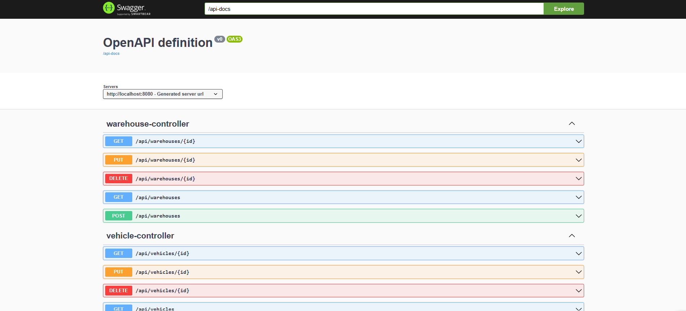
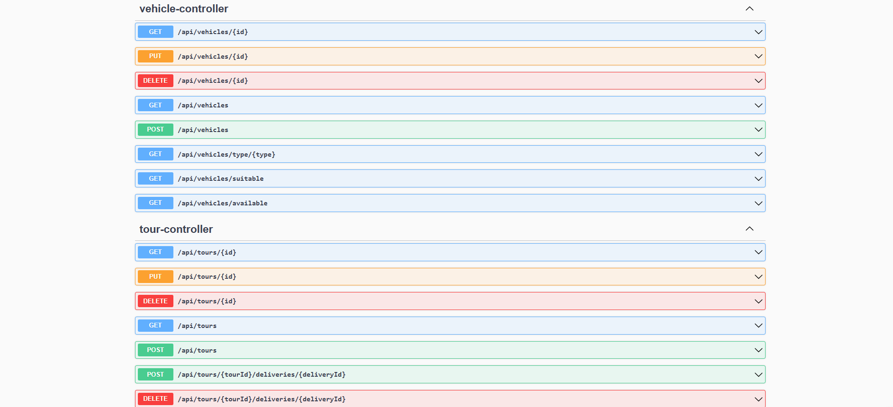
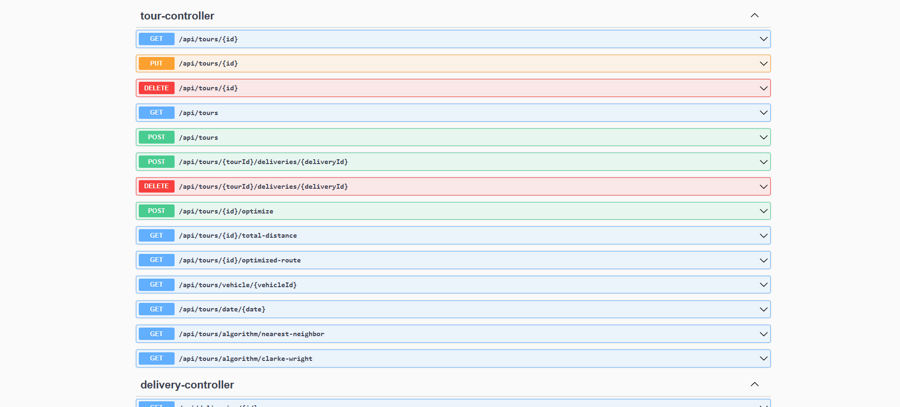
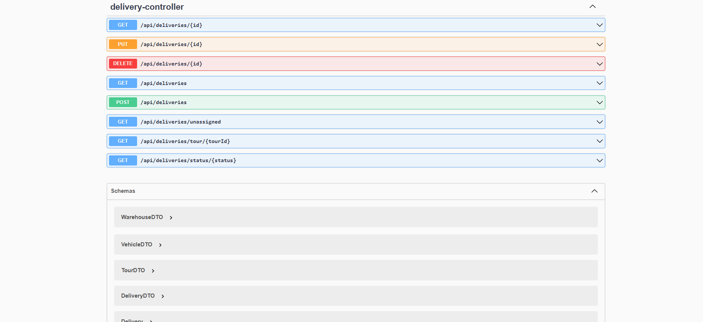

# 🚚 WASALOWAFAR - Système d'Optimisation des Tournées de Livraison

<div align="center">


**Solution intelligente d'optimisation des tournées de livraison développée avec Spring Boot**

</div>

## 🌟 Fonctionnalités

### 🔧 Fonctionnalités Techniques
- **Optimisation Intelligente** : Calcul de tournées optimisées avec algorithmes avancés
- **API REST Complète** : Endpoints RESTful pour toutes les opérations
- **Documentation Interactive** : Interface Swagger UI intégrée
- **Validation Métier** : Contraintes réalistes sur poids, volume et capacités
- **Tests Unitaires** : Couverture complète avec JUnit 5 et Mockito

### 📦 Gestion des Ressources
- ✅ **Livraisons** : Gestion complète avec statuts et créneaux horaires
- ✅ **Véhicules** : Flotte multi-types (vélos, camionnettes, camions)
- ✅ **Tournées** : Planification et optimisation des trajets
- ✅ **Entrepôts** : Points de départ avec coordonnées GPS

## 🛠️ Stack Technique

| Composant | Version | Usage |
|-----------|---------|--------|
| **Java** | 17 | Langage principal |
| **Spring Boot** | 3.4.10 | Framework backend |
| **Spring Data JPA** | 3.4.10 | Persistance des données |
| **H2 Database** | 2.3.232 | Base de données embarquée |
| **Maven** | 3.9+ | Gestion des dépendances |
| **SpringDoc OpenAPI** | 2.1.0 | Documentation API |
| **JUnit 5** | 5.10+ | Tests unitaires |
| **Mockito** | 5.11+ | Mocking pour les tests |

## 🚀 Démarrage Rapide

### Prérequis
- **JDK 17** ou supérieur
- **Maven 3.9** ou supérieur
- **Git** pour le clonage

### Installation & Exécution

1. **Cloner le repository**
```bash
git clone https://github.com/ichrakjaifra/delivery-optimization-system.git
cd delivery-optimization-system
```
2. **Construire le projet**
```bash
mvn clean install
```
3. **Lancer l'application**
```bash
mvn spring-boot:run
```
4. **Accéder à l'application**
```bash
Application : http://localhost:8080
Swagger UI : http://localhost:8080/swagger-ui.html
Base H2     : http://localhost:8080/h2-console
```

## Configuration Base de données H2
```
URL : jdbc:h2:file:./data/deliverydb
User : sa
Password : (vide)
```

## diagramme de classe 


## 📚 API Documentation




